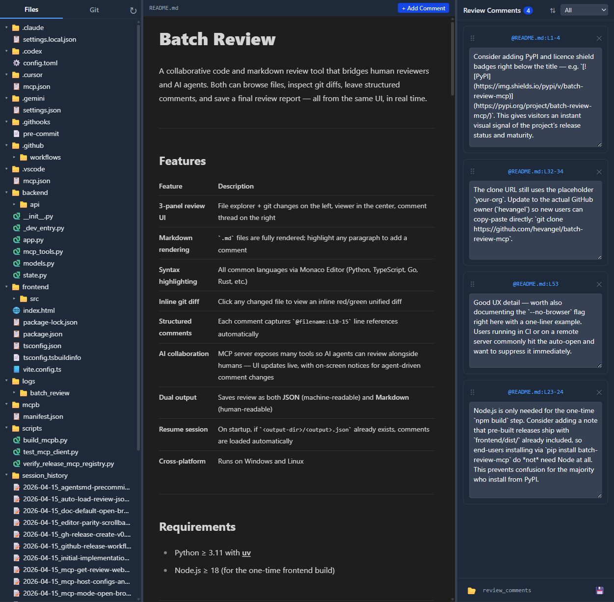

# Batch Review

A collaborative code and markdown review tool that bridges human reviewers and AI agents. Both can browse files, inspect git diffs, leave structured comments, and save a final review report — all from the same UI, in real time.



---

## Features

| Feature | Description |
|---|---|
| **3-panel review UI** | File explorer + git changes on the left, viewer in the center, comment thread on the right |
| **Markdown rendering** | `.md` files are fully rendered; highlight any paragraph to add a comment |
| **Syntax highlighting** | All common languages via Monaco Editor (Python, TypeScript, Go, Rust, etc.) |
| **Inline git diff** | Click any changed file to view an inline red/green unified diff |
| **Structured comments** | Each comment captures `@filename:L10-15` line references automatically |
| **AI collaboration** | MCP server exposes many tools so AI agents can review alongside humans — UI updates live, with on-screen notices for agent-driven comment changes |
| **Dual output** | Saves review as both **JSON** (machine-readable) and **Markdown** (human-readable) |
| **Resume session** | On startup, if `<output-dir>/<output>.json` already exists, comments are loaded automatically |
| **Cross-platform** | Runs on Windows and Linux |

---

## Requirements

- Python ≥ 3.11 with [uv](https://docs.astral.sh/uv/)
- Node.js ≥ 18 (for the one-time frontend build)

---

## Installation

```bash
git clone https://github.com/your-org/batch-review-mcp
cd batch-review-mcp
uv sync
```

The first run will automatically build the React frontend if `frontend/dist/` does not exist (requires Node.js + npm on `PATH`).

---

## Usage

### Standalone mode (browser opens by default)

```bash
# Review the current directory
uv run batch-review

# Review a specific git repository
uv run batch-review --root /path/to/your/repo

# Custom host / port
uv run batch-review --root /path/to/repo --host 0.0.0.0 --port 9100

# Specify output filenames
uv run batch-review --root /path/to/repo --output review --output-dir /tmp/reviews
# → saves /tmp/reviews/review.json and /tmp/reviews/review.md
```

The server auto-selects a free port in the 9000–9999 range if the default port is already in use.

### MCP stdio mode (Claude Desktop / Cursor / any MCP client; browser opens by default)

```bash
uv run batch-review --mcp --root /path/to/repo
```

The HTTP server starts in a background thread (so the browser UI remains accessible), your default browser opens to the app URL (same as standalone mode; use `--no-browser` to skip), and the MCP stdio transport runs in the main thread.

**Claude Desktop config** (`claude_desktop_config.json`):

```json
{
  "mcpServers": {
    "batch-review": {
      "command": "uv",
      "args": ["run", "batch-review", "--mcp", "--root", "/path/to/repo"]
    }
  }
}
```

### Official MCP registry

This project includes a root-level [`server.json`](./server.json) for the [Model Context Protocol registry](https://registry.modelcontextprotocol.io/) (preview). The entry uses **`registryType": "mcpb"`**: the download URL must be a **public** GitHub release asset, and **`fileSha256`** must match those bytes **exactly** (the [Release](.github/workflows/release.yml) workflow builds the `.mcpb` on **Linux**, which can differ from a pack produced on Windows).

**Recommended order for a new version (e.g. `v0.2.0`):**

1. Bump **`version`** in `pyproject.toml`, **`mcpb/manifest.json`**, and **`server.json`** (top-level `version` plus `packages[0].identifier` URL: `.../releases/download/v0.2.0/batch-review-mcp-0.2.0.mcpb`).
2. In GitHub **Actions**, run **[MCP registry preflight (Linux MCPB hash)](.github/workflows/mcp-registry-preflight.yml)** (`workflow_dispatch`). Open the job summary and copy the printed **SHA-256** into **`server.json`** → **`packages[0].fileSha256`**. Commit and push to `main`.
3. Push the **tag** (e.g. `git tag v0.2.0 && git push origin v0.2.0`). The **Release** workflow runs `scripts/verify_release_mcp_registry.py` before uploading; if `identifier`, versions, or **`fileSha256`** do not match the Linux-built `.mcpb`, the job **fails** so you never publish a broken asset to the registry.
4. After the release exists, run **`mcp-publisher publish`** (with [`mcp-publisher`](https://github.com/modelcontextprotocol/registry/releases) and `mcp-publisher login github`). Optional: add **`PYPI_API_TOKEN`** so the same workflow can **`uv publish`** the wheel/sdist.

If a tag already exists but the Release workflow itself needed a workflow-only fix, you can
rerun it manually from **Actions** via `workflow_dispatch` by providing `release_tag`
(for example `v0.2.0`). That manual path checks out the tag you name, overlays the current
release metadata from `main`, and reuses the existing tag name, so you can recover the
release without moving the tag or rebuilding from a different code revision.

`scripts/build_mcpb.py` rewrites the packed archive deterministically after `mcpb pack`, so
the Linux SHA from preflight should match the Linux SHA seen again in the Release workflow
for the same source tree.

### CLI flags

| Flag | Default | Description |
|---|---|---|
| `--root PATH` | current directory | Git repository to review |
| `--host HOST` | `127.0.0.1` | Bind address |
| `--port PORT` | `9000` | Preferred port (auto-increments if busy) |
| `--output NAME` | `review_comments` | Base filename for saved output (no extension) |
| `--output-dir DIR` | repo root | Directory to write output files |
| `--mcp` | off | Enable MCP stdio transport |
| `--no-browser` | false (omit) | **Normal behavior** (flag omitted): browser opens automatically ~1.2s after the server is ready in standalone, `--dev`, and `--mcp`. Pass `--no-browser` to disable. |
| `--skip-build` | off | Skip the npm build step |

---

## UI Walkthrough

### Left panel — two tabs

**Files tab** — recursive directory tree. Click a file to open it in the center panel.

**Git tab** — lists files changed relative to HEAD with status badges:
- 🟡 `M` modified
- 🟢 `A` added
- 🔴 `D` deleted
- ⚪ `U` untracked

Click a changed file to open it in inline diff mode.

### Center panel

- **Markdown files** — fully rendered. Select any text with the mouse and click **+ Add Comment** to create a comment anchored to those line numbers.
- **Code files** — Monaco Editor with syntax highlighting. Select lines and click **+ Add Comment** in the toolbar.
- **Diff view** — Monaco DiffEditor showing original (HEAD) vs working tree inline (red = removed, green = added). Switch back to normal view via the Git tab or by clicking the file in the Files tab.

### Right panel

Each comment shows:
- `@filename:L10-15` reference — click to jump to that location in the center panel
- A text area for your review notes (auto-saves on blur)
- A delete button

The **💾 Save Review** button saves all comments to:
- `<output-dir>/<output>.json` — machine-readable JSON array
- `<output-dir>/<output>.md` — human-readable Markdown report grouped by file

When the server starts, if that JSON file already exists it is **loaded into the session** so you can continue a saved review (invalid files are skipped with a log warning).

---

## MCP Tools

AI agents connect via `http://localhost:<port>/mcp` (HTTP transport) or stdio (`--mcp` flag).

The MCP surface is intentionally **review-first**. Batch Review is not trying to be a
general repo browser or editor API; it is a shared review-state server for:

- identifying the review scope
- inspecting diffs and just enough file context
- adding or updating anchored review comments
- saving or resuming the review session

A typical agent flow is:

1. Call `get_git_changes()`
2. Call `get_git_diff(path)` for files worth reviewing
3. Use `get_file_content(path)` only when extra non-diff context is needed
4. Add or update comments, optionally driving the shared UI with open/highlight/jump tools
5. Save or load the review session with the review file tools

### Repo-local MCP host configuration

This repository includes checked-in defaults so common agents can use **Batch Review** and **Playwright** together:

| Product | Config file | Format |
| --- | --- | --- |
| **Cursor** (editor and `agent` CLI) | [`.cursor/mcp.json`](.cursor/mcp.json) | `mcpServers` with `"type": "stdio"` |
| **VS Code / GitHub Copilot** | [`.vscode/mcp.json`](.vscode/mcp.json) | `servers` with `"type": "stdio"` ([reference](https://code.visualstudio.com/docs/copilot/reference/mcp-configuration)) |
| **Claude Code** | [`.mcp.json`](.mcp.json) | Project `mcpServers` (stdio) |
| **OpenAI Codex CLI** | [`.codex/config.toml`](.codex/config.toml) | `[mcp_servers.<name>]` stdio blocks (loaded for trusted projects) |
| **Gemini CLI** | [`.gemini/settings.json`](.gemini/settings.json) | Top-level `mcpServers` ([guide](https://google-gemini.github.io/gemini-cli/docs/tools/mcp-server.html)) |

All definitions run `uv run batch-review --mcp --root . --skip-build` so the review root is the **workspace directory** hosts use as the server cwd. Cursor’s `agent` CLI does not always expand `${workspaceFolder}` inside `args`, so these configs use `"."` for `--root` (VS Code may still use `${workspaceFolder}` in `.vscode/mcp.json`, which that host expands).

### Verifying stdio MCP

```bash
# Smoke test with the official Python MCP client
uv run python scripts/test_mcp_client.py

# Cursor Agent CLI (after install: https://cursor.com/docs/cli )
cd /path/to/batch_review_mcp
agent mcp enable batch-review
agent mcp list-tools batch-review
agent --approve-mcps -p "Your prompt that may call MCP tools"
```

| Tool | Description |
|---|---|
| `get_git_changes()` | List changed files vs HEAD |
| `get_git_diff(path)` | Unified diff + original/modified content |
| `add_comment(...)` | Add a review comment; shows a short notice in the UI |
| `update_comment(comment_id, text)` | Edit comment body; UI notice |
| `delete_comment(id)` | Delete a comment; UI notice |
| `list_comments()` | List all in-memory comments |
| `list_review_files()` | List stems of `*.json` reviews in `output_dir` |
| `load_review_by_stem(stem)` | Replace comments from `{stem}.json`; UI notice |
| `save_comments(output_stem?, output_dir?)` | Save JSON + Markdown report, returns paths |
| `get_file_content(path)` | Read file content as structured data (`content`, `line_count`, `language`, `path`) when diff context alone is not enough |
| `list_directory(path)` | Minimal repo navigation helper for hosts that want the review file tree |
| `open_file_in_ui(path, mode)` | Open a file in the browser center panel (`view` or `diff`) |
| `highlight_in_ui(path, line_start, line_end)` | Open a file and highlight a 1-based line range in the UI |
| `jump_to_comment_in_ui(comment_id)` | Same as clicking a comment’s `@file:L…` link: open the file and highlight that anchor |
| `get_config()` | Return `output_stem`, `output_dir`, and `web_ui_url` (when the server has bound) |
| `get_review_web_url()` | Return `web_ui`, `websocket`, and `mcp_http` URLs for the running app |
| *(resource)* | MCP resource URI **`batch-review://server/urls`** — same URL JSON as `get_review_web_url` (`resources/read`) |

Comment **add**, **update**, **delete**, and **load_review_by_stem** also push a dismissible toast at the bottom of the right panel (similar styling to the post-save path hints).

---

## Output formats

### JSON (`review_comments.json`)

```json
[
  {
    "id": "4c66b5fc-...",
    "file_path": "src/auth.py",
    "line_start": 42,
    "line_end": 55,
    "reference": "@src/auth.py:L42-55",
    "text": "Token is never validated — add expiry check.",
    "created_at": "2026-04-15T10:00:00+00:00"
  }
]
```

### Markdown (`review_comments.md`)

```markdown
# Code Review

_Generated: 2026-04-15 10:00 UTC — 3 comment(s)_

---

## src/auth.py

### `@src/auth.py:L42-55`
> Token is never validated — add expiry check.

---
```

---

## Development

```bash
# Backend only (no frontend build needed)
uv run batch-review --root . --skip-build --no-browser

# Frontend dev server (proxies API to port 9000)
cd frontend && npm run dev

# Full production build
cd frontend && npm run build
```

---

## License

[MIT](LICENSE)
