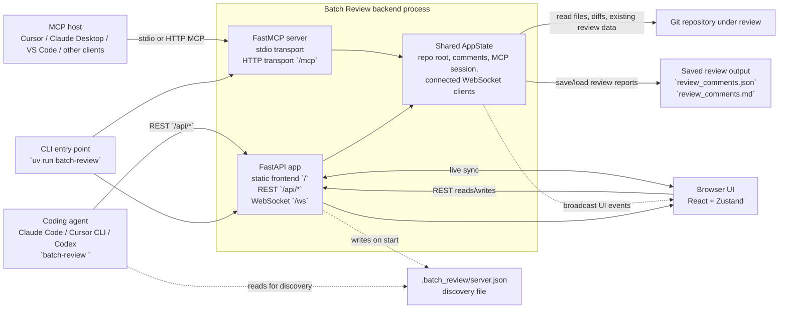

# Batch Review

A collaborative code and markdown review tool that bridges human reviewers and AI agents. Both can browse files, inspect git diffs, leave structured comments, and save a final review report — all from the same UI, in real time.


---

## Features

| Feature | Description |
|---|---|
| **3-panel review UI** | File explorer + git changes on the left, viewer in the center, comment thread on the right |
| **Markdown rendering** | `.md` files are fully rendered, including [GitHub-style math](https://docs.github.com/en/get-started/writing-on-github/working-with-advanced-formatting/writing-mathematical-expressions) with KaTeX: inline `$…$` and GitHub’s dollar-backtick inline form, display `$$…$$` blocks, and fenced `math` code blocks; plus Mermaid fenced diagrams and WaveDrom fenced diagrams (digital timing diagrams, bit-field/register diagrams, and logic/schematic diagrams), each with a toolbar toggle between rendered and source views; highlight any paragraph to add a comment |
| **HTML previewing** | `.html` and `.htm` files render in a sandboxed center-panel preview with scripts disabled; select rendered elements, text, or a visual region to add source-backed comments, including a saved PNG crop for region comments |
| **PDF viewing** | `.pdf` files render in the center panel with page-aware text or region comments and reload support |
| **DOCX/PPTX viewing** | `.docx` and `.pptx` files render locally in the browser with `docx-preview` and `@aiden0z/pptx-renderer`; select document text or a normalized page/slide region to add comments, with Office region selections saved as PNG screenshots beside the review JSON/Markdown output, without LibreOffice or Microsoft Office |
| **Office document safety** | Office packages are fetched as binary data; git diff mode reports them as binary instead of showing misleading ZIP/XML text |
| **Syntax highlighting** | All common languages via Monaco Editor (Python, TypeScript, Go, Rust, etc.) |
| **Inline git diff** | Click changed files to view inline red/green unified diffs for local changes, a previous commit/ref vs `HEAD`, or current checkout vs a GitHub PR head |
| **Structured comments** | Each comment captures `@filename:L10-15` line references automatically, with richer rendered-view anchors where useful; Office anchors include document kind, page/slide, normalized region, selected text, and a renderer fingerprint |
| **Outdated recovery** | When a text comment goes stale, refresh its stored highlight from the current file directly from the right panel |
| **AI collaboration** | MCP server exposes many tools so AI agents can review alongside humans — UI updates live, with on-screen notices for agent-driven comment changes. Also ships a token-efficient **CLI client mode** (`batch-review <verb>`) for coding agents and a **Claude Code plugin** with a review-workflow skill |
| **Dual output** | Saves review as both **JSON** (machine-readable) and **Markdown** (human-readable) |
| **Resume session** | On startup, if `{output-dir}/{output}.json` already exists, comments are loaded automatically |
| **Cross-platform** | Runs on Windows and Linux |
| **Theme toggle** | Switch the web UI between the original dark theme and a warm light theme from the left-panel top bar |

### GitHub-style math example

The preview uses the delimiter rules from [Writing mathematical expressions](https://docs.github.com/en/get-started/writing-on-github/working-with-advanced-formatting/writing-mathematical-expressions): inline `$…$`, GitHub’s dollar-backtick inline form (rewritten to `$…$` before parsing), display `$$…$$`, and fenced `math` code blocks. Rendering is **KaTeX** rather than GitHub’s MathJax, so a few uncommon macros can differ even when markdown syntax matches.

This app does not embed raw HTML in the markdown preview, so GitHub’s `<span>$</span>` workaround for literal dollar signs in prose is unavailable here—inside math, escape `$` as `\$` per GitHub’s docs.

Examples:

Inline: $\sqrt{3x-1}+(1+x)^2$

Dollar-backtick (GitHub-compatible): $`e^{i\pi} + 1 = 0`$

$$
\nabla_\theta J(\theta) = \mathbb{E}_{(s, a) \sim \pi_\theta}
\left[\nabla_\theta \log \pi_\theta(a \mid s)\, R(s, a)\right]
$$

### WaveDrom example

Fenced ` ```wavedrom ` blocks are parsed as [WaveJSON](https://wavedrom.com/tutorial.html) (via
JSON5, so unquoted/single-quoted keys are fine) and rendered inline, with the same
source/rendered toolbar toggle as Mermaid. Three diagram kinds are supported, selected
automatically from the JSON shape:

A digital timing diagram (`signal`):

```wavedrom
{signal: [
  {name: 'clk',  wave: 'p.....'},
  {name: 'data', wave: 'x.345x', data: ['head', 'body', 'tail']},
  {name: 'req',  wave: '0.1..0'},
  {name: 'ack',  wave: '1.....'}
]}
```

A bit-field / register diagram (`reg`):

```wavedrom
{reg: [
  {bits: 7, name: 'opcode'},
  {bits: 5, name: 'rd'},
  {bits: 3, name: 'funct3'},
  {bits: 5, name: 'rs1'},
  {bits: 12, name: 'imm[11:0]'}
], config: {bits: 32}}
```

A logic / schematic diagram (`assign`):

```wavedrom
{assign: [["z", ["|", "a", ["&", "b", "c"]]]]}
```

---

## Architecture

At runtime, Batch Review is a single Python application that serves the browser UI, exposes REST and WebSocket endpoints for that UI, and optionally exposes the same review session to MCP clients.


```mermaid
flowchart LR
    CLI["CLI entry point<br/>`uv run batch-review`"]
    Browser["Browser UI<br/>React + Zustand"]
    McpHost["MCP host<br/>Cursor / Claude Desktop / VS Code / other clients"]
    AgentCli["Coding agent<br/>Claude Code / Cursor CLI / Codex<br/>`batch-review <verb>`"]

    subgraph Backend["Batch Review backend process"]
        Server["FastAPI app<br/>static frontend `/`<br/>REST `/api/*`<br/>WebSocket `/ws`"]
        Mcp["FastMCP server<br/>stdio transport<br/>HTTP transport `/mcp`"]
        State["Shared AppState<br/>repo root, comments, MCP session,<br/>connected WebSocket clients"]
    end

    Repo["Git repository under review"]
    Output["Saved review output<br/>`review_comments.json`<br/>`review_comments.md`"]
    PortFile[".batch_review/server.json<br/>discovery file"]

    CLI --> Server
    CLI --> Mcp
    Server --> Browser
    Browser -->|"REST reads/writes"| Server
    Browser <-->|"live sync"| Server
    Server --> State
    Mcp --> State
    McpHost -->|"stdio or HTTP MCP"| Mcp
    AgentCli -->|"REST `/api/*`"| Server
    AgentCli -.->|"reads for discovery"| PortFile
    Server -.->|"writes on start"| PortFile
    State -->|"read files, diffs, existing review data"| Repo
    State -->|"save/load review reports"| Output
    State -.->|"broadcast UI events"| Browser
```

- The browser loads the React app from the FastAPI server, fetches files/comments/config over REST, and stays synchronized through `/ws`.
- MCP tools and REST routes both operate on the same in-memory `AppState`, so agent-created comments appear in the UI immediately.
- In `--mcp` mode, the HTTP server keeps the web UI available while FastMCP also runs over stdio for editor and CLI hosts.
- In **CLI client mode**, coding agents invoke `batch-review <verb>` (e.g. `add-comment`, `diff`) which calls the same REST endpoints — no MCP tool schemas loaded into agent context. The server writes `.batch_review/server.json` on startup so CLI verbs can discover it.

---

## Distribution

- **[PyPI — `batch-review-mcp`](https://pypi.org/project/batch-review-mcp/)** — published wheels and sdist for `pip` / `uv`.
- **[Official MCP Registry — `io.github.hevangel/batch-review-mcp`](https://registry.modelcontextprotocol.io/v0.1/servers/io.github.hevangel%2Fbatch-review-mcp/versions/latest)** — latest published server metadata (JSON API; the [registry site](https://registry.modelcontextprotocol.io/) is still preview).

---

## Requirements

- Python ≥ 3.13 with [uv](https://docs.astral.sh/uv/)
- Node.js ≥ 22 (for the one-time frontend build; matches GitHub Actions)

---

## Installation

```bash
git clone https://github.com/hevangel/batch-review-mcp.git
cd batch-review-mcp
uv sync
```

The first run will automatically build the React frontend if `frontend/dist/` does not exist (requires Node.js + npm on `PATH`).

---

## Usage

### Standalone mode (browser opens by default)

```bash
# Review the current directory
uv run batch-review

# Review a specific git repository
uv run batch-review --root /path/to/your/repo

# Custom host / port
uv run batch-review --root /path/to/repo --host 0.0.0.0 --port 9100

# Specify output filenames
uv run batch-review --root /path/to/repo --output review --output-dir /tmp/reviews
# → saves /tmp/reviews/review.json and /tmp/reviews/review.md
```

The server auto-selects a free port in the 9000–9999 range if the default port is already in use.

### MCP stdio mode (Claude Desktop / Cursor / any MCP client; browser opens by default)

```bash
uv run batch-review --mcp --root /path/to/repo
```

The HTTP server starts in a background thread (so the browser UI remains accessible), your default browser opens to the app URL (same as standalone mode; use `--no-browser` to skip), and the MCP stdio transport runs in the main thread.

**Claude Desktop config** (`claude_desktop_config.json`):

```json
{
  "mcpServers": {
    "batch-review": {
      "command": "uv",
      "args": ["run", "batch-review", "--mcp", "--root", "/path/to/repo"]
    }
  }
}
```

### CLI client mode (token-efficient agent interface)

For coding agents (Claude Code, Cursor CLI, Codex, etc.), the CLI client mode is more token-efficient than loading 18 MCP tool schemas into context. Each verb is one process invocation that emits a single JSON document to stdout. The CLI talks to a running server over REST, so every comment and highlight also appears in the human reviewer's browser UI in real time.

```bash
# Start the server in the background (browser opens by default)
batch-review start --root .
# {"web_url": "http://127.0.0.1:9000", "pid": 12345, "port": 9000}

# List changed files
batch-review changes
# [{"path": "main.py", "status": "M", ...}, ...]

# Inspect a diff
batch-review diff main.py

# Add a comment anchored to a line range
batch-review add-comment main.py 10 15 "This null check is redundant."

# Save the review report (JSON + Markdown)
batch-review save

# Stop the server when done
batch-review stop
```

**Server discovery** — verbs auto-discover a running server in priority order: the `BATCH_REVIEW_WEB_URL` env var, then `<repo_root>/.batch_review/server.json` (written by `start`), then probing ports 9000–9999.

**Verb reference** — all verbs accept `--root PATH` (default: cwd):

| Verb | Args | Description |
|---|---|---|
| `start` | `[--port N] [--no-browser]` | Start the server in the background |
| `stop` | — | Stop the running server |
| `config` | — | Server config (output stem, dir, web URL) |
| `url` | — | Connection URLs (web UI, WebSocket, MCP HTTP) |
| `changes` | `[--mode local\|commit\|pr] [--base REF] [--pr N]` | List changed files |
| `diff` | `<path> [--mode ...]` | Unified diff + original/modified content |
| `ls` | `[path] [--depth N]` | List files/directories |
| `file` | `<path>` | Read file content + line count + language |
| `add-comment` | `<path> <L1> <L2> [text] [--highlighted TEXT]` | Add a comment |
| `list-comments` | — | List all comments |
| `update-comment` | `<id> <text>` | Edit a comment's text |
| `delete-comment` | `<id>` | Delete one comment |
| `clear` | — | Delete all comments |
| `delete-outdated` | — | Delete stale comments |
| `recompute-stale` | — | Recompute outdated flags |
| `save` | `[--stem NAME] [--dir DIR]` | Save to JSON + Markdown |
| `load` | `<stem>` | Load a saved review |
| `list-reviews` | — | List saved review stems |
| `open` | `<path> [--mode view\|diff]` | Open a file in the browser UI |
| `highlight` | `<path> <L1> <L2>` | Highlight a line range in the UI |
| `jump` | `<comment-id>` | Jump to a comment's location in the UI |

Output contract: JSON on stdout, progress messages on stderr, non-zero exit on error. The `start` verb is backward-compatible — if a server is already running, it reports the existing URL instead of starting a duplicate.

### Claude Code plugin

This repo ships a Claude Code plugin (CLI-only — no MCP server entry, so agents don't load tool schemas into context). Install it from the marketplace:

```
/plugin marketplace add hevangel/batch-review-mcp
/plugin install batch-review@batch-review
```

The plugin bundles:
- **Skill** ([`skills/batch-review/SKILL.md`](skills/batch-review/SKILL.md)) — teaches the agent the review workflow using CLI verbs.
- **Command** ([`commands/batch-review.md`](commands/batch-review.md)) — a `/batch-review` slash command that triggers the skill.
- **Plugin manifest** ([`.claude-plugin/plugin.json`](.claude-plugin/plugin.json)) + **marketplace** ([`.claude-plugin/marketplace.json`](.claude-plugin/marketplace.json)).

### Agent skill (skills.sh)

The review-workflow skill is also installable into any agent that supports the open [Agent Skills](https://github.com/vercel-labs/skills) standard (Claude Code, Cursor, Codex, Gemini CLI, Copilot, ZCode, and 60+ others) via the [`npx skills`](https://www.skills.sh/) CLI:

```bash
# Install globally (available across all your projects)
npx skills add hevangel/batch-review-mcp --global --yes

# Or install into a specific agent only
npx skills add hevangel/batch-review-mcp --skill batch-review --agent claude-code --global

# List available skills without installing
npx skills add hevangel/batch-review-mcp --list
```

Once installed, the skill auto-triggers when you ask your agent to review code, inspect diffs, or leave review comments. Discovery and listing on [skills.sh](https://www.skills.sh/) happens automatically via install telemetry — there is no manual submission step.

### Official MCP registry

This project includes a root-level [`server.json`](./server.json) for the [Model Context Protocol registry](https://registry.modelcontextprotocol.io/) (preview). The entry uses **`registryType": "mcpb"`**: the download URL must be a **public** GitHub release asset, and **`fileSha256`** must match those bytes **exactly** (the [Release](.github/workflows/release.yml) workflow builds the `.mcpb` on **Linux**, which can differ from a pack produced on Windows).

**Recommended order for a new version (e.g. `v0.4.3`):**

1. Bump **`version`** in `pyproject.toml`, **`mcpb/manifest.json`**, and **`server.json`** (top-level `version` plus `packages[0].identifier` URL: `.../releases/download/v0.4.3/batch-review-mcp-0.4.3.mcpb`).
2. Commit and push that release-prep change to `main`.
3. Push the **tag** (e.g. `git tag v0.4.3 && git push origin v0.4.3`).
4. The **Release** workflow builds the Linux artifacts again, runs `scripts/update_server_json_mcpb_sha.py` to patch `server.json` in the workflow workspace from the Linux-built `.mcpb`, runs `scripts/verify_release_mcp_registry.py`, creates or updates the GitHub release, publishes `server.json` to the MCP Registry via **GitHub Actions OIDC** (`mcp-publisher login github-oidc`), and publishes the wheel/sdist to PyPI when **`PYPI_API_TOKEN`** is configured. If `identifier` or versions do not match the tag, or if the patched `server.json` still does not match the Linux-built `.mcpb`, the job **fails** so you never publish a broken asset to the registry.

The separate **[MCP registry preflight (Linux MCPB hash)](.github/workflows/mcp-registry-preflight.yml)** workflow is now optional. It is still useful when you want to inspect the Linux-built bundle bytes before tagging or debug a registry mismatch, but normal releases no longer require copying a SHA into `server.json` by hand.

If a tag already exists but the Release workflow itself needed a workflow-only fix, you can
rerun it manually from **Actions** via `workflow_dispatch` by providing `release_tag`
(for example `v0.4.3`). That manual path checks out the tag you name, overlays the current
release metadata from `main`, and reuses the existing tag name, so you can recover the
release without moving the tag or rebuilding from a different code revision. That rerun path
also repairs MCP Registry publication because the workflow republishes `server.json` from the
current `main` branch metadata and recomputes the Linux `fileSha256` before verify/publish.

`scripts/build_mcpb.py` rewrites the packed archive deterministically after `mcpb pack`, so
the Linux SHA from preflight should match the Linux SHA seen again in the Release workflow
for the same source tree.

Local `mcp-publisher login github` remains useful for one-off manual publishes, but normal
tagged releases no longer require workstation device-code confirmation.

### CLI flags

The `batch-review` command dispatches on its first argument: if it's a known **CLI verb** (`start`, `stop`, `changes`, `diff`, `add-comment`, etc.), it runs as a token-efficient client that talks to a running server over REST. Otherwise, it runs as the server with these flags:

| Flag | Default | Description |
|---|---|---|
| `--root PATH` | current directory | Git repository to review |
| `--host HOST` | `127.0.0.1` | Bind address |
| `--port PORT` | `9000` | Preferred port (auto-increments if busy) |
| `--output NAME` | `review_comments` | Base filename for saved output (no extension) |
| `--output-dir DIR` | repo root | Directory to write output files |
| `--mcp` | off | Enable MCP stdio transport |
| `--no-browser` | false (omit) | **Normal behavior** (flag omitted): browser opens automatically ~1.2s after the server is ready in standalone, `--dev`, and `--mcp`. Pass `--no-browser` to disable. |
| `--skip-build` | off | Skip the npm build step |

See **CLI client mode** above for the full verb reference, or run `batch-review --help`.

---

## UI Walkthrough

### Left panel — two tabs

**Files tab** — lazy directory tree. The first render loads only the first few levels so large repositories stay responsive; expanding a folder loads its children on demand while deeper folders continue hydrating in the background. Click a file to open it in the center panel.

The top bar also includes a theme toggle next to the reload control. The app starts in dark mode and remembers your light/dark choice in the browser.

**Git tab** — lists files changed relative to the active compare mode with status badges:
- 🟡 `M` modified
- 🟢 `A` added
- 🔴 `D` deleted
- ⚪ `U` untracked

Use **Local** for working tree/index changes vs `HEAD`, **Commit** for a previous commit/ref vs current `HEAD`, or **PR** for current checkout vs a GitHub PR head (enter a PR number or URL). Click a changed file to open it in inline diff mode with labels for the selected left and right sides.

### Center panel

- **No file selected** — shows a lightweight getting-started panel with the app title and a short reminder: open a file or diff on the left, add comments, then save the review.
- **Markdown files** — fully rendered with a toolbar toggle between rendered preview and Markdown source. Relative image embeds render inline, GitHub-compatible math syntax (KaTeX) supports inline `$…$`, dollar-backtick inline, display `$$…$$`, and fenced math blocks ([GitHub docs](https://docs.github.com/en/get-started/writing-on-github/working-with-advanced-formatting/writing-mathematical-expressions)), Mermaid fenced blocks can switch between rendered diagrams and raw source via the center-panel toolbar, WaveDrom fenced blocks (` ```wavedrom `) render digital timing diagrams, bit-field/register diagrams (`reg`), and logic/schematic diagrams (`assign`) with the same source/rendered toolbar toggle, links to other repo files open in the app, and links like `other.md#heading` open that file and jump to the heading in the center panel.
- **HTML files** — rendered in a sandboxed preview with scripts disabled and a toolbar toggle back to source. Hover/click rendered elements or select rendered text to create comments anchored to the source HTML line range plus an element selector/fingerprint; use **Region** mode for visual layout issues, which stores a normalized rendered-page rectangle and a PNG crop saved beside the review JSON. Repo-local CSS and image assets load through a safe raw-content endpoint.
- **PDF files** — rendered page-by-page in the center panel. Text-selection comments remember the highlighted text on that page even if you click the toolbar Add button, while region comments keep a page rectangle and save a PNG crop beside the review JSON (`Ctrl+Alt+C`).
- **DOCX files** — rendered locally as best-effort Word pages in the browser and scaled down to fit the available center-panel content width while preserving page proportions. Select text for a page-aware document anchor, or switch to **Region** mode to comment on a visual page region; the selected region is captured as a PNG saved beside the review JSON/Markdown output. This uses `docx-preview`; complex Word layout and pagination can differ from Microsoft Word, and document anchors are retained as best-effort fingerprints rather than backend-verified stale text ranges.
- **PPTX files** — rendered locally as browser-native slides using `@aiden0z/pptx-renderer`. Select text where the browser renderer exposes it, or use **Region** mode for a slide rectangle; selected slide regions are captured as PNG files saved beside the review JSON/Markdown output. Embedded EMF/PDF fallback rendering is disabled to keep the existing PDF.js 4.x dependency unchanged.
- **Office diffs** — DOCX/PPTX changes are reported as binary packages instead of raw ZIP/XML diffs. Open the current document viewer for visual review; semantic old/new document diffing is not yet provided.
- **Code files** — Monaco Editor with syntax highlighting. Select lines and click **+ Add Comment** in the toolbar.
- **Diff view** — Monaco DiffEditor showing the selected compare sides inline (red = removed, green = added). Switch back to normal view via the Git tab or by clicking the file in the Files tab.

### Right panel

Each comment shows:
- `@filename:L10-15` reference — click to jump to that location in the center panel
- A text area for your review notes (auto-saves on blur)
- For outdated text comments, a refresh icon inside the textbox that re-captures the current highlighted text at that line range and clears the outdated state
- A delete button

The **💾 Save Review** button saves all comments to:
- `{output-dir}/{output}.json` — machine-readable JSON array
- `{output-dir}/{output}.md` — human-readable Markdown report grouped by file

Rendered HTML, PDF, DOCX, and PPTX region screenshots are saved as PNG files in the same output directory and referenced by filename from the matching JSON comment (and copied alongside custom output paths).

When the server starts, if that JSON file already exists it is **loaded into the session** so you can continue a saved review (invalid files are skipped with a log warning). Loading a saved review from the right-panel folder button also updates the active review stem shown in the footer so subsequent saves target that loaded review name by default.

---

## MCP Tools

AI agents connect via `http://localhost:PORT/mcp` (HTTP transport) or stdio (`--mcp` flag).

The MCP surface is intentionally **review-first**. Batch Review is not trying to be a
general repo browser or editor API; it is a shared review-state server for:

- identifying the review scope
- inspecting diffs and just enough file context
- adding or updating anchored review comments
- saving or resuming the review session

A typical agent flow is:

1. Call `get_git_changes()`
2. Call `get_git_diff(path)` for files worth reviewing
3. Use `get_file_content(path)` only when extra non-diff context is needed
4. Add or update comments, optionally driving the shared UI with open/highlight/jump tools
5. Save or load the review session with the review file tools

### Protocol compatibility

This server now uses [`fastmcp` 4.0.2](https://pypi.org/project/fastmcp/4.0.2/) with the MCP Python SDK 2.x (`mcp>=2.0.0,<3.0`). FastMCP 4 supports both MCP protocol eras, so existing hosts can continue using the legacy connection-scoped `initialize` handshake while modern clients use the stateless protocol path.

The legacy era uses protocol revision `2025-11-25` and `Mcp-Session-Id` session management for streamable HTTP. The MCP spec's modern revision **[`2026-07-28`](https://modelcontextprotocol.io/specification/2026-07-28)** replaces that handshake with per-request `_meta.io.modelcontextprotocol/*` fields, adds `MCP-Protocol-Version` / `Mcp-Method` / `Mcp-Name` headers to streamable HTTP, and requires `server/discover`. FastMCP and the MCP SDK own this negotiation and transport behavior; Batch Review does not add a competing protocol-compatibility layer.

FastMCP 4.0.2 also requires the newer Starlette generation, so the project declares `fastapi>=0.133.0` and `uvicorn[standard]>=0.35.0` alongside the FastMCP upgrade. The exact reproducible versions are recorded in [`uv.lock`](uv.lock), currently FastMCP 4.0.2 and MCP 2.1.1.

The active protocol version is surfaced in the `get_config` MCP tool and the `GET /api/config` REST endpoint under a `protocol` key:

```json
{
  "active_protocol_version": "2026-07-28",
  "supported_protocol_versions": ["2025-11-25", "2026-07-28"],
  "pending_protocol_versions": [],
  "modern_era_available": true
}
```

The single source of truth for these values is [`backend/mcp_compat.py`](backend/mcp_compat.py).

### Repo-local MCP host configuration

This repository includes checked-in defaults so common agents can use **Batch Review** and **Playwright** together:

| Product | Config file | Format |
| --- | --- | --- |
| **Cursor** (editor and `agent` CLI) | [`.cursor/mcp.json`](.cursor/mcp.json) | `mcpServers` with `"type": "stdio"` |
| **VS Code / GitHub Copilot** | [`.vscode/mcp.json`](.vscode/mcp.json) | `servers` with `"type": "stdio"` ([reference](https://code.visualstudio.com/docs/copilot/reference/mcp-configuration)) |
| **Claude Code** | [`.mcp.json`](.mcp.json) | Project `mcpServers` (stdio) |
| **OpenAI Codex CLI** | [`.codex/config.toml`](.codex/config.toml) | `[mcp_servers.NAME]` stdio blocks (loaded for trusted projects) |
| **Gemini CLI** | [`.gemini/settings.json`](.gemini/settings.json) | Top-level `mcpServers` ([guide](https://google-gemini.github.io/gemini-cli/docs/tools/mcp-server.html)) |

All definitions run `uv run batch-review --mcp --root . --skip-build` so the review root is the **workspace directory** hosts use as the server cwd. Cursor’s `agent` CLI does not always expand `${workspaceFolder}` inside `args`, so these configs use `"."` for `--root` (VS Code may still use `${workspaceFolder}` in `.vscode/mcp.json`, which that host expands).

### Verifying stdio MCP

```bash
# Smoke test with the official Python MCP client
uv run python scripts/test_mcp_client.py

# Cursor Agent CLI (after install: https://cursor.com/docs/cli )
cd /path/to/batch_review_mcp
agent mcp enable batch-review
agent mcp list-tools batch-review
agent --approve-mcps -p "Your prompt that may call MCP tools"
```

| Tool | Description |
|---|---|
| `init_batch_review_session(coding_agent, model_name?, client_version?)` | **Call first** once per MCP connection; registers the host and model. Other tools return an error until this succeeds (except `get_config`, `get_review_web_url`, and resource `batch-review://server/urls`). |
| `get_git_changes()` | List changed files vs HEAD |
| `get_git_diff(path)` | Unified diff + original/modified content |
| `add_comment(...)` | Add a review comment; source comments use line ranges, while DOCX/PPTX comments can use `document_kind`, `document_page`, normalized regions, `document_anchor`, and `document_fingerprint`; shows a short notice in the UI |
| `update_comment(comment_id, text)` | Edit comment body; UI notice |
| `delete_comment(id)` | Delete a comment; UI notice |
| `clear_all_comments()` | Remove every in-memory comment at once; UI notice |
| `delete_outdated_comments()` | Remove comments with ``outdated`` true; UI notice |
| `list_comments()` | List all in-memory comments |
| `recompute_comment_stale()` | Re-scan files vs ``highlighted_text`` and set each comment's ``outdated`` flag; UI notice |
| `list_review_files()` | List stems of `*.json` reviews in `output_dir` |
| `load_review_by_stem(stem)` | Replace comments from `{stem}.json`; UI notice |
| `save_comments(output_stem?, output_dir?)` | Save JSON + Markdown report, returns paths |
| `get_file_content(path)` | Read file content as structured data (`content`, `line_count`, `language`, `path`) when diff context alone is not enough |
| `list_directory(path)` | Minimal repo navigation helper for hosts that want the review file tree |
| `open_file_in_ui(path, mode)` | Open a file in the center panel (`view` or `diff`); same path+mode refreshes the view |
| `highlight_in_ui(path, line_start?, line_end?, pdf_page?, region_x1?, …)` | **Source files:** ``line_start``–``line_end`` (1-based). **PDFs:** ``pdf_page`` + ``region_*`` normalized 0–1 on that page. **Images:** ``region_*`` in original pixels. **DOCX/PPTX:** ``document_page`` + normalized ``region_*`` (and optional `document_kind`/anchor fields) |
| `jump_to_comment_in_ui(comment_id)` | Same as clicking a comment’s `@file:L…` link: open the file and highlight that anchor |
| `get_config()` | Return `output_stem`, `output_dir`, and `web_ui_url` (when the server has bound) |
| `get_review_web_url()` | Return `web_ui`, `websocket`, and `mcp_http` URLs for the running app |
| *(resource)* | MCP resource URI **`batch-review://server/urls`** — same URL JSON as `get_review_web_url` (`resources/read`); readable **before** `init_batch_review_session` |

Agents should call **`init_batch_review_session`** immediately after connecting (with a non-empty `coding_agent`, e.g. `Cursor` or `Claude Desktop`). The server enforces this: calling any other tool first yields a clear “call init…” error.

Comment **add**, **update**, **delete**, **clear_all_comments**, **delete_outdated_comments**, **recompute_comment_stale**, and **load_review_by_stem** also push a dismissible toast at the bottom of the right panel (similar styling to the post-save path hints).

---

## Output formats

### JSON (`review_comments.json`)

```json
[
  {
    "id": "4c66b5fc-...",
    "file_path": "src/auth.py",
    "line_start": 42,
    "line_end": 55,
    "reference": "@src/auth.py:L42-55",
    "text": "Token is never validated — add expiry check.",
    "highlighted_text": "…",
    "region_screenshot_file": null,
    "region_screenshot_width": null,
    "region_screenshot_height": null,
    "outdated": false,
    "created_at": "2026-04-15T10:00:00+00:00"
  }
]
```

### Markdown (`review_comments.md`)

```markdown
# Code Review

_Generated: 2026-04-15 10:00 UTC — 3 comment(s)_

---

## src/auth.py

### `@src/auth.py:L42-55`
> Token is never validated — add expiry check.

---
```

---

## Development

```bash
# Backend only (no frontend build needed)
uv run batch-review --root . --skip-build --no-browser

# Frontend dev server (proxies API to port 9000)
cd frontend && npm run dev

# Full production build
cd frontend && npm run build
```

For contributor documentation, name `session_history/` files with the actual date of the AI session that produced the change rather than copying the date from an older entry.

---

## License

[MIT](LICENSE)
